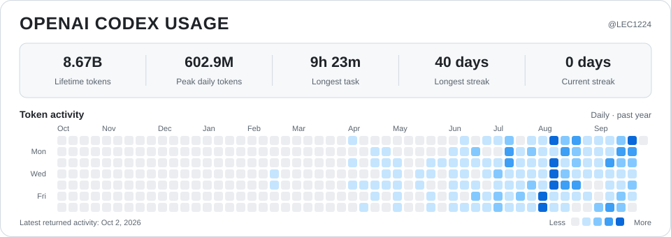

<picture>
  <source media="(prefers-color-scheme: dark)" srcset="assets/codex-usage-dark.svg">
  <source media="(prefers-color-scheme: light)" srcset="assets/codex-usage-light.svg">
  
</picture>

Updated automatically from my Codex account. The card shows the latest activity returned by OpenAI.
